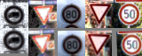

# **Traffic Sign Recognition** 

## Writeup

---

**Build a Traffic Sign Recognition Project**

The goals / steps of this project are the following:
* Load the data set (see below for links to the project data set)
* Explore, summarize and visualize the data set
* Design, train and test a model architecture
* Use the model to make predictions on new images
* Analyze the softmax probabilities of the new images
* Summarize the results with a written report

[//]: # (Image References)

[image1]: ./examples/histogram_visualization.png "Visualization"
[image2]: ./examples/normalized.png "Histogram normalization"
[image3]: ./examples/random_noise.jpg "Random Noise"
[image4]: ./examples/allimages.png "All test images"

## Rubric Points
### Here I will consider the [rubric points](https://review.udacity.com/#!/rubrics/481/view) individually and describe how I addressed each point in my implementation.  

---
### Writeup / README

#### 1. Provide a Writeup / README that includes all the rubric points and how you addressed each one. You can submit your writeup as markdown or pdf. You can use this template as a guide for writing the report. The submission includes the project code.

You're reading it! and here is a link to my [project code](Traffic_Sign_Classifier.ipynb)

### Data Set Summary & Exploration

#### 1. Provide a basic summary of the data set. In the code, the analysis should be done using python, numpy and/or pandas methods rather than hardcoding results manually.

I used the numpy library to calculate summary statistics of the traffic
signs data set:

* The size of training set is 34799
* The size of the validation set is 4410
* The size of test set is 12630
* The shape of a traffic sign image is 32x32
* The number of unique classes/labels in the data set is 43

#### 2. Include an exploratory visualization of the dataset.

Here is an exploratory visualization of the data set. It is a bar chart showing how often different types of the traffic signs occur in the database.

![alt text][image1]

### Design and Test a Model Architecture

#### 1. Describe how you preprocessed the image data. What techniques were chosen and why did you choose these techniques? Consider including images showing the output of each preprocessing technique. Pre-processing refers to techniques such as converting to grayscale, normalization, etc. (OPTIONAL: As described in the "Stand Out Suggestions" part of the rubric, if you generated additional data for training, describe why you decided to generate additional data, how you generated the data, and provide example images of the additional data. Then describe the characteristics of the augmented training set like number of images in the set, number of images for each class, etc.)

As a first step, I decided to normalize the histogram, in both color and grayscale mode, to reduce over/under exposure and differences in contrast.

Here is an example of a traffic sign image before and after adjusting histogram.

As a last step, I normalized the image data to improve training convergence.

I decided to introduce data augmentation to prevent overfitting. I used the following techniques: rotation, scaling and translation, because these types of differences occur naturally in the database.

Here is an example of an original image and an augmented image:

No new dataset is generated, instead data is augmented dynamically during training.

#### 2. Describe what your final model architecture looks like including model type, layers, layer sizes, connectivity, etc.) Consider including a diagram and/or table describing the final model.

My final model consisted of the following layers:

| Layer         		|     Description	        					| 
|:---------------------:|:---------------------------------------------:| 
| Input         		| 32x32x3 RGB image or 32x32x1 greyscale image   							| 
| Convolution 7x7     	| 1x1 stride, valid padding, outputs 26x26x96 	|
| RELU					|												|
| Convolution 5x5     	| 1x1 stride, valid padding, outputs 22x22x128 	|
| RELU					|												|
| Max pooling	      	| 2x2 stride,  outputs 11x11x128 				|
| Convolution 4x4     	| 1x1 stride, valid padding, outputs 8x8x256 	|
| RELU					|												|
| Max pooling	      	| 2x2 stride,  outputs 4x4x256 				|
| Fully connected		| outputs 352	|
| RELU					|												|
| Fully connected		| outputs 128	|
| RELU					|												|
| Fully connected		| outputs 43	|
| Softmax				|      	|
 
Furthermore, I have trained overall 6 models, 3 for each of the 2 normalization techniques (with or without grayscaling), using different initial weights to train each model.

#### 3. Describe how you trained your model. The discussion can include the type of optimizer, the batch size, number of epochs and any hyperparameters such as learning rate.

To train the model, I used an adam optimizer. Batch size was set to 256 and the number of epochs to 30. Learning rate was determined automatically by the optimizer. 

#### 4. Describe the approach taken for finding a solution and getting the validation set accuracy to be at least 0.93. Include in the discussion the results on the training, validation and test sets and where in the code these were calculated. Your approach may have been an iterative process, in which case, outline the steps you took to get to the final solution and why you chose those steps. Perhaps your solution involved an already well known implementation or architecture. In this case, discuss why you think the architecture is suitable for the current problem.

My final model results were:
* training set accuracy of 0.999885
* validation set accuracy of 0.997052
* test set accuracy of 0.985193

First architecture chosen was LeNet, which achieved only 90% accuracy after 30 epochs. Since training accuracy was close to 100%, this indicated overfitting. Adding 0.7 dropout layers improved validation accuracy to 93%. Accuracy has been further improved by adding one convolutional layer and significantly increasing depth of convolutional layers (which resemles architecture used in "Committee of CNNs" by IDSIA team), achieving validation accuracy close to 99% for both normalization methods (with / without grayscaling). Taking further inspiration from "Committee of CNNs" architecture, final model averages logits predicted by 6 networks: 3 networks with grayscaling in preprocessing step and 3 networks without grayscaling (each network has been trained from different starting point), which allowed to achieve validation accuracy of 99.7% and test accuracy of 98.5%, which is not too far from human performance (98.8%).

### Test a Model on New Images

#### 1. Choose five German traffic signs found on the web and provide them in the report. For each image, discuss what quality or qualities might be difficult to classify.

Since all 5 German were predicted correctly with 100% accuracy, additional 5 cartoon-like traffic signs has been tested, as well as 5 random images.

Here are 15 images that I found on the web:
  
![alt text][image4]

#### 2. Discuss the model's predictions on these new traffic signs and compare the results to predicting on the test set. At a minimum, discuss what the predictions were, the accuracy on these new predictions, and compare the accuracy to the accuracy on the test set (OPTIONAL: Discuss the results in more detail as described in the "Stand Out Suggestions" part of the rubric).

Here are the results of the prediction:

| Image			        |     Prediction	        					| 
|:---------------------:|:---------------------------------------------:| 
| Yield	      		| Yield					 				|
| Go straight or left					| Go straight or left											|
| Priority road      		| Priority road   									| 
| No vehicles			| No vehicles      							|
| Children crossing     			| Children crossing 										|

The model was able to correctly guess 5 of the 5 traffic signs, which gives an accuracy of 100%. This compares favorably to the accuracy on the test set of 98.5%

#### 3. Describe how certain the model is when predicting on each of the five new images by looking at the softmax probabilities for each prediction. Provide the top 5 softmax probabilities for each image along with the sign type of each probability. (OPTIONAL: as described in the "Stand Out Suggestions" part of the rubric, visualizations can also be provided such as bar charts)

The code for making predictions on my final model is located in the 11th cell of the Ipython notebook.

For the first image, the model is sure that this is a priority sign (probability of 1.0), and the image does contain a priority sign. The top five soft max probabilities were

| Probability         	|     Prediction	        					| 
|:---------------------:|:---------------------------------------------:| 
| 1.0         			| Priority road   									| 
| 1.0     				| Children crossing 										|
| 1.0					| Go straight or left											|
| 1.0	      			| Yield					 				|
| 1.0				    | No vehicles      							|

For the second image ... 

### (Optional) Visualizing the Neural Network (See Step 4 of the Ipython notebook for more details)
#### 1. Discuss the visual output of your trained network's feature maps. What characteristics did the neural network use to make classifications?

